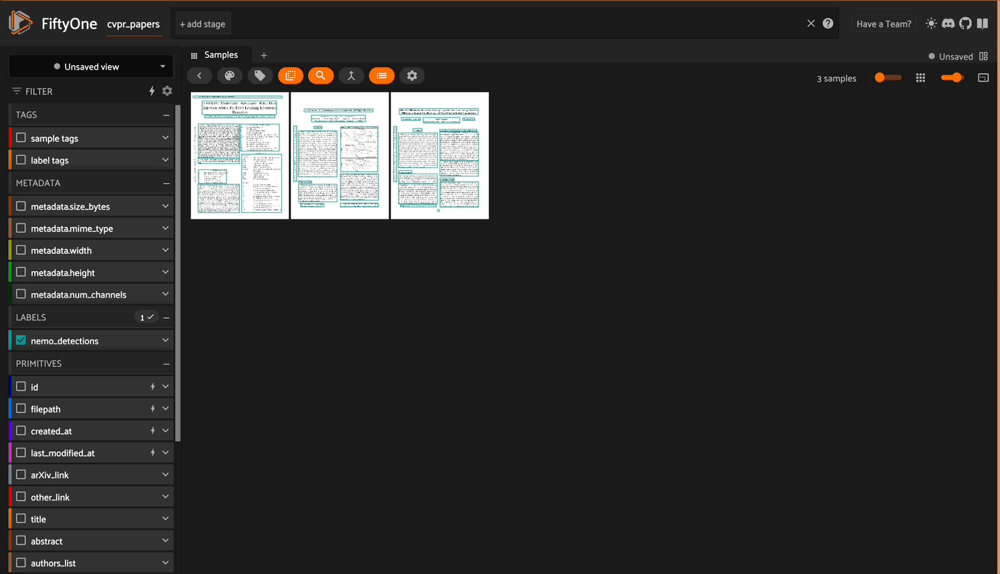

# FiftyOne NeMo Retriever Parse Plugin



A FiftyOne plugin that integrates NVIDIA's NeMo Retriever Parse model to detect and extract text regions from documents with their spatial locations.


This plugin enables you to process documents in your FiftyOne dataset through NVIDIA's NeMo Retriever Parse model. It detects various types of text elements (titles, paragraphs, tables, etc.) and their locations in the document, returning both the text content and bounding box coordinates.

#### NeMo Retriever Parse

See the [Model Card](https://build.nvidia.com/nvidia/nemoretriever-parse/modelcard) for full details.

NVIDIA's **NeMo Retriever Parse** is an advanced Vision-Language Model (VLM) designed for document transcription and structured text extraction from images. It is part of the broader NeMo Retriever framework, which enables multimodal data extraction, embedding, and reranking for retrieval-augmented generation (RAG) pipelines.

### Key Features of NeMo Retriever Parse

**Document Transcription**: 
   - Extracts text from document images in reading order while preserving semantic structure.
   - Outputs text in various formats, including structured markdown, bounding boxes, and classifications (e.g., headers, paragraphs, captions) to retain spatial layout and formatting.

2. **Modes of Operation**:

   - **Bounding Box, Class, and Markdown Mode**: Extracts text with bounding boxes and content classifications, outputting markdown for semantic organization.

   - **No Bounding Box, No Class, Markdown Mode**: Focuses on hierarchical structure without spatial positioning.

   - **Detection Only Mode**: Detects and classifies text regions without transcription.

### NOTE: This plugin operates in Bounding Box, Class, and Markdown Mode

3. **Underlying Technology**:
   - Utilizes Commercial RADIO (C-RADIO) for visual feature extraction and mBART as the decoder for text generation.
   - Built on a transformer-based vision-encoder-decoder architecture optimized for NVIDIA GPUs.

4. **Applications**:
   - Parsing PDFs, PowerPoint presentations, and other documents to extract structured data such as tables, charts, and infographics.
   - Enhancing retriever systems by improving accuracy in downstream tasks like LLM training and document understanding pipelines.

### Performance Highlights
- **High Throughput**: Achieves 15x faster multimodal data extraction throughput compared to open-source alternatives.
- **Accuracy Improvements**: Reduces incorrect answers by 50% during retrieval tasks.
- **Efficient Storage**: Offers 35x improved data storage efficiency with dynamic length support for embeddings.

### Use Cases

NeMo Retriever Parse is tailored for enterprise applications such as:

- Financial document analysis (e.g., parsing tabular data from 10-K reports).

- AI-powered customer service assistants.

- Video search and summarization.

- Building code documentation agents.

### Limitations

The model is currently in beta (v0.2) and is intended for demonstration purposes rather than production use. It operates under NVIDIA's Software License Agreement.

In summary, NeMo Retriever Parse represents a cutting-edge solution for extracting structured information from diverse document types, enabling high-performance retrieval workflows in enterprise AI applications.


## Installation

```bash
# First install FiftyOne if you haven't already
pip install fiftyone

# Install required dependencies
pip install requests tqdm
```

## Requirements

- NVIDIA API key for accessing the NeMo Retriever Parse model. You can obtain an NVIDIA API key by following [this link](https://nvda.ws/3LspiUP).

- FiftyOne dataset containing document images

## Usage

First, install the Plugin:

```bash
fiftyone plugins download https://github.com/harpreetsahota204/nemo_retriever_parse_plugin
```

You can install requirements via

```bash
fiftyone plugins requirements @harpreetsahota/nemo_retriever_parse --install
```


## Example Operator Usage

```python
import fiftyone.operators as foo

nemo_parser = foo.get_operator("@harpreetsahota/nemo_retriever_parse/run_nemo_retriever_parse")
```

When running in a notebook you follow these steps:

1. Ensure that you have set the environment variable `os.environ['FIFTYONE_ALLOW_LEGACY_ORCHESTRATORS'] = 'true'` (or set in the same terminal enviornment where you launch the app from)

2. Kick off a Delegated Service by opening your terminal and executing `fiftyone delegated launch`

3. Use the `await` syntax and pass `delegate=True` into your operator calls, as shown below:

```python
await nemo_parser(
    dataset, #whatever your dataset is
    api_key=<your-nvidia-api-key>,
    delegate=True
    )
```

## Features

The plugin adds the following fields to each sample in your Dataset:

- `nemo_detections`: FiftyOne Detections object containing:
  - Bounding boxes for each detected text region
  - Text content for each region
  - Label indicating the type of text (Title, Text, Table, etc.)

- Token usage statistics:
  - `nemo_prompt_tokens`: Number of prompt tokens used
  - `nemo_completion_tokens`: Number of completion tokens used
  - `nemo_total_tokens`: Total tokens used


## Output Format

The plugin adds FiftyOne Detections in the following format:

```python
Detection(
    label="Title",  # Type of text region
    bounding_box=[x, y, width, height],  # Normalized coordinates
    text="Actual text content"  # Extracted text
)
```

## Error Handling

- If processing fails for any image, empty detections and zero token counts are added to maintain dataset alignment
- Errors are logged but don't halt dataset processing
- All API calls include appropriate timeouts and error handling

## Notes

- The plugin uses NVIDIA's API which may have rate limits or usage costs
- Coordinates are normalized to [0,1] range
- Processing time depends on document complexity and API response time
- Token usage is tracked per document for cost monitoring

# Citation

```bibtex
@misc{nemo_retriever_parse,
  title        = {NVIDIA NeMo Retriever Parse},
  author       = {NVIDIA Corporation},
  year         = {2025},
  howpublished = {\url{https://developer.nvidia.com/nemo-retriever}},
  note         = {A vision-language model for document transcription and structured text extraction. Governed by NVIDIA Software License Agreement.}
}
```